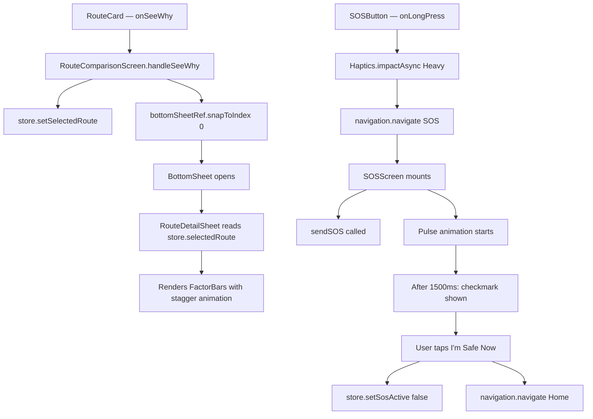

# Design Document — AegisPath Phase 2 & Phase 3

## Overview

This document describes the technical design for extending AegisPath with two major capabilities:

**Phase 2 — Explainability Bottom Sheet**
A `@gorhom/bottom-sheet` overlay slides up from `RouteComparisonScreen` when the user taps "See Why →" on any route card. The sheet renders a `RouteDetailSheet` inline component that reads `selectedRoute` from the Zustand store and displays the safety score, four animated `FactorBar` components (Crime, Time, Crowd, Infra), all confidence badges, and the full narrative. The `DayNightToggle` gains a Reanimated spring animation on its active indicator.

**Phase 3 — SOS System**
A floating `SOSButton` sits in the bottom-right corner of `RouteComparisonScreen`. A 1-second long press triggers haptic feedback and navigates to `SOSScreen`, a full-screen red emergency view that pulses, calls `sendSOS()` (which opens the SMS composer via `expo-sms`), and after 1.5 seconds transitions to a success checkmark with an "I'm Safe Now" reset button.

All new code extends existing files without altering folder structure, naming, or existing logic. The light theme and `colors.js` design tokens are used throughout.

---

## Architecture

The feature follows the existing unidirectional data flow pattern: UI events → Zustand store mutations → component re-renders. No new state management libraries are introduced.



### Key Architectural Decisions

**BottomSheet placement**: The `BottomSheet` is rendered at the bottom of `RouteComparisonScreen`'s JSX tree (after the `FlatList`), outside the `SafeAreaView` scroll area, so it overlays the full screen correctly. The entire screen root is wrapped in `GestureHandlerRootView` as required by `@gorhom/bottom-sheet` v5.

**RouteDetailSheet as inline component**: `RouteDetailSheet` is defined as a named function inside `RouteComparisonScreen.jsx` rather than a separate file. This avoids a new file while keeping the JSX readable, and it has direct access to the `useRouteStore` hook without prop drilling.

**Staggered animation ownership**: Each `FactorBar` owns its own fill animation (`withTiming`). The stagger delay (`withDelay(index * 100, ...)`) is applied by the parent `RouteDetailSheet` via a wrapper `Animated.View` controlling opacity, keeping `FactorBar` reusable and self-contained.

**SOS state in Zustand**: `sosActive` is stored in the Zustand `useRouteStore` rather than local component state so that any future screen can react to the SOS state (e.g., showing a persistent banner).

---

## Components and Interfaces

### FactorBar.jsx (new)

```
Props:
  label: string        — display name (e.g., "Crime")
  value: number        — integer 0–100

Internal:
  fillWidth: SharedValue<number>   — animated from 0 → (value/100 * trackWidth)
  trackWidth: number               — measured via onLayout

Rendering:
  Row: label text (left) + percentage text (right)
  Track: grey background bar, full width
  Fill: Animated.View inside track, width driven by fillWidth shared value
```

Color logic (pure function, no store dependency):
- `value < 35` → `colors.safe` (`#22C55E`)
- `value < 60` → `colors.moderate` (`#F59E0B`)
- `value >= 60` → `colors.highRisk` (`#EF4444`)

Animation: `withTiming(targetWidth, { duration: 600 })` triggered in `useEffect` after `onLayout` fires.

### DayNightToggle.jsx (updated)

The static `active` style on the pill `View` is replaced with a `Reanimated.View` sliding indicator positioned absolutely inside the container. A `useSharedValue(translateX)` is driven by `withSpring` (stiffness 200, damping 20) whenever `timeMode` changes. All existing `onToggle` prop behaviour is preserved — the component remains a controlled component driven by `timeMode` from the store.

```
New internal state:
  translateX: SharedValue<number>   — 0 for 'day', pillWidth for 'night'

Animation trigger:
  useEffect([timeMode]) → translateX.value = withSpring(target, { stiffness: 200, damping: 20 })
```

### SOSButton.jsx (new)

```
Props:
  onLongPress: () => void

Rendering:
  TouchableOpacity
    delayLongPress={1000}
    style: absolute, bottom: 32, right: 24
    backgroundColor: colors.highRisk (#EF4444)
    borderRadius: 999 (circle), width/height: 64
    shadow (iOS) + elevation: 8 (Android)
  Text: "SOS", white, fontWeight 800, fontSize 16
```

### SOSScreen.jsx (new)

```
Local state:
  done: boolean — false until 1500ms timer fires

Reanimated shared values:
  scale: SharedValue<number>    — pulse: 1 → 1.3 → 1 (looping)
  opacity: SharedValue<number>  — pulse: 1 → 0.4 → 1 (looping)

useEffect on mount:
  1. sendSOS()
  2. Start pulse: withRepeat(withSequence(withTiming(1.3, 600), withTiming(1.0, 600)), -1)
  3. setTimeout(1500) → setDone(true)

Rendering (done === false):
  Full-screen red (#EF4444) background
  Animated circle (scale + opacity)
  "Sending Alert…" text

Rendering (done === true):
  Checkmark ✓ (large, white)
  "Alert Sent" text
  "I'm Safe Now" TouchableOpacity button
    → setSosActive(false) + navigation.navigate('Home')
```

### sendSOS.js (new)

```javascript
import * as SMS from 'expo-sms';

export async function sendSOS() {
  try {
    const available = await SMS.isAvailableAsync();
    if (available) {
      await SMS.sendSMSAsync([], 'I need help. Please track my location.');
    }
  } catch (_) {
    // silent no-op — never throw from SOS service
  }
}
```

### RouteDetailSheet (inline in RouteComparisonScreen)

```
Reads: selectedRoute from useRouteStore (returns null-safe early exit)

Renders:
  ScrollView (for long narratives)
    route label (emoji + label.toUpperCase())
    safetyScore — large text, color: getRiskColor(riskLevel)
    4 × stagger wrapper (Animated.View, opacity 0→1 with withDelay(i*100, withTiming(1, 400)))
          └── FactorBar label={name} value={selectedRoute.factors[key]}
    badge row — selectedRoute.badges.map → ConfidencePill
    narrative — full text, no numberOfLines cap
```

Factor order and keys:
| Index | Label   | Key     |
|-------|---------|---------|
| 0     | Crime   | crime   |
| 1     | Time    | time    |
| 2     | Crowd   | crowd   |
| 3     | Infra   | infra   |

---

## Data Models

### Extended Route Object (no schema change — factors already in demoRoutes.json)

```typescript
interface Route {
  id: string;
  label: string;
  emoji: string;
  duration: string;
  distance: string;
  isRecommended: boolean;
  zone: { crimeLevel: number; crowdLevel: string; infraLevel: string };
  timeHour: number;
  // enriched by mockAPI:
  safetyScore: number;       // 0–100
  riskScore: number;         // 0–100
  riskLevel: 'LOW' | 'MODERATE' | 'HIGH';
  narrative: string;
  badges: Badge[];
  // already in demoRoutes.json:
  factors: {
    crime: number;   // 0–100
    time: number;    // 0–100
    crowd: number;   // 0–100
    infra: number;   // 0–100
  };
}

interface Badge {
  icon: string;
  label: string;
  type: 'safe' | 'risk';
}
```

### Zustand Store Extensions

```typescript
// Additions to useRouteStore
sosActive: boolean;                        // default: false
setSosActive: (value: boolean) => void;    // set({ sosActive: value })
```

The existing `selectedRoute`, `setSelectedRoute`, `routes`, `timeMode`, `setTimeMode`, `fetchRoutes`, `isLoading`, and `error` fields are unchanged.

---

## Correctness Properties

*A property is a characteristic or behavior that should hold true across all valid executions of a system — essentially, a formal statement about what the system should do. Properties serve as the bridge between human-readable specifications and machine-verifiable correctness guarantees.*

### Property 1: FactorBar renders label and proportional fill for any valid input

*For any* string `label` and integer `value` in [0, 100], rendering a `FactorBar` should display the label text in the output and the animated fill target width should equal `(value / 100) * trackWidth`.

**Validates: Requirements 2.1, 2.2**

---

### Property 2: FactorBar colour mapping is correct for all values

*For any* integer `value` in [0, 100], the colour assigned to the FactorBar fill should be `colors.safe` when `value < 35`, `colors.moderate` when `35 ≤ value < 60`, and `colors.highRisk` when `value ≥ 60`.

**Validates: Requirements 2.3**

---

### Property 3: RouteCard onSeeWhy callback passes the exact route object

*For any* route object passed as a prop to `RouteCard`, pressing the "See Why →" button should invoke the `onSeeWhy` callback with that exact same route object (referential identity).

**Validates: Requirements 4.3**

---

### Property 4: handleSeeWhy stores the exact route in the RouteStore

*For any* route object, calling `handleSeeWhy(route)` in `RouteComparisonScreen` should result in `useRouteStore.getState().selectedRoute` being strictly equal to that route object.

**Validates: Requirements 4.1**

---

### Property 5: RouteDetailSheet renders all route data fields

*For any* route object with a label, safetyScore, badges array, and narrative string, the `RouteDetailSheet` component should render the route's label text, the safetyScore as a number, exactly `badges.length` `ConfidencePill` instances, and the complete narrative string without truncation.

**Validates: Requirements 5.1, 5.4, 5.5**

---

### Property 6: RouteComparisonScreen renders correct number of RouteCards when loaded

*For any* array of route objects, when `isLoading` is `false` and `routes` contains that array, `RouteComparisonScreen` should render exactly `routes.length` `RouteCard` components and zero `SkeletonCard` components.

**Validates: Requirements 7.2**

---

### Property 7: setSosActive round-trip correctness

*For any* boolean value `v`, calling `setSosActive(v)` on the RouteStore should result in `sosActive === v` in the store state.

**Validates: Requirements 11.4**

---

## Error Handling

### sendSOS failures
`sendSOS()` wraps all SMS operations in a `try/catch` and silently swallows errors. The SOS flow must never crash the app due to SMS unavailability (simulator, no SIM, permissions denied). The `SOSScreen` does not await `sendSOS()` in a way that blocks the UI — it fires and forgets.

### Null selectedRoute in RouteDetailSheet
`RouteDetailSheet` performs an early `if (!selectedRoute) return null` guard before accessing any route properties. This prevents null-reference errors when the BottomSheet is in a transitional state (e.g., animating closed after `selectedRoute` is cleared).

### BottomSheet ref safety
`bottomSheetRef.current?.snapToIndex(0)` uses optional chaining so that if the ref is not yet attached (e.g., during initial render), no error is thrown.

### Navigation guard on SOSScreen
`SOSScreen` uses `navigation.navigate('Home')` rather than `navigation.goBack()` to ensure the user always lands on the Home screen regardless of navigation stack depth, avoiding a potential "no screen to go back to" error.

### Reanimated worklet safety
All `useAnimatedStyle` callbacks are pure worklet functions with no side effects. Shared values are initialised before any animation is triggered, preventing undefined-value worklet crashes.

---

## Testing Strategy

### Unit Tests (example-based)

These tests verify specific behaviours with concrete inputs:

- **DayNightToggle**: Render with `timeMode='day'`, press Night pill, verify `onToggle` called with `'night'`. Repeat for Day.
- **BottomSheet initial state**: Render `RouteComparisonScreen`, verify `BottomSheet` has `index={-1}`.
- **BottomSheet snap on See Why**: Mock `bottomSheetRef`, tap "See Why →", verify `snapToIndex(0)` called.
- **SOSButton callback**: Render `SOSButton` with mock `onLongPress`, simulate long press (1000ms delay), verify callback invoked.
- **SOSScreen sendSOS call**: Mock `sendSOS`, render `SOSScreen`, verify `sendSOS` called once on mount.
- **SOSScreen checkmark transition**: Render `SOSScreen` with fake timers, advance 1500ms, verify checkmark element present and pulse circle absent.
- **"I'm Safe Now" navigation**: Mock store and navigation, render `SOSScreen` in done state, tap button, verify `setSosActive(false)` and `navigate('Home')` called.
- **sendSOS — SMS available**: Mock `SMS.isAvailableAsync` → `true`, call `sendSOS()`, verify `sendSMSAsync` called with `([], 'I need help. Please track my location.')`.
- **sendSOS — SMS unavailable**: Mock `SMS.isAvailableAsync` → `false`, call `sendSOS()`, verify resolves without error and `sendSMSAsync` not called.
- **RouteDetailSheet null guard**: Render with `selectedRoute=null`, verify no crash and empty output.

### Property-Based Tests

Property-based tests use a PBT library (recommended: **fast-check** for JavaScript/React Native) with a minimum of **100 iterations** per property. Each test is tagged with a comment referencing the design property.

**Property 1 — FactorBar label and fill**
```
// Feature: aegispath-phase2-phase3, Property 1: FactorBar renders label and proportional fill
fc.assert(fc.property(
  fc.string({ minLength: 1 }),
  fc.integer({ min: 0, max: 100 }),
  (label, value) => {
    const { getByText } = render(<FactorBar label={label} value={value} />);
    expect(getByText(label)).toBeTruthy();
    // verify fill target = value/100 * trackWidth via onLayout mock
  }
), { numRuns: 100 });
```

**Property 2 — FactorBar colour mapping**
```
// Feature: aegispath-phase2-phase3, Property 2: FactorBar colour mapping is correct for all values
fc.assert(fc.property(
  fc.integer({ min: 0, max: 100 }),
  (value) => {
    const expected = value < 35 ? colors.safe : value < 60 ? colors.moderate : colors.highRisk;
    expect(getFactorBarColor(value)).toBe(expected);
  }
), { numRuns: 100 });
```

**Property 3 — RouteCard onSeeWhy callback identity**
```
// Feature: aegispath-phase2-phase3, Property 3: RouteCard onSeeWhy passes exact route object
fc.assert(fc.property(
  arbitraryRoute(),
  (route) => {
    const onSeeWhy = jest.fn();
    const { getByText } = render(<RouteCard route={route} onSeeWhy={onSeeWhy} onNavigate={() => {}} />);
    fireEvent.press(getByText('See Why →'));
    expect(onSeeWhy).toHaveBeenCalledWith(route);
  }
), { numRuns: 100 });
```

**Property 4 — handleSeeWhy stores route in store**
```
// Feature: aegispath-phase2-phase3, Property 4: handleSeeWhy stores exact route in RouteStore
fc.assert(fc.property(
  arbitraryRoute(),
  (route) => {
    useRouteStore.getState().setSelectedRoute(route);
    expect(useRouteStore.getState().selectedRoute).toBe(route);
  }
), { numRuns: 100 });
```

**Property 5 — RouteDetailSheet renders all route data**
```
// Feature: aegispath-phase2-phase3, Property 5: RouteDetailSheet renders all route data fields
fc.assert(fc.property(
  arbitraryRouteWithBadges(),
  (route) => {
    useRouteStore.setState({ selectedRoute: route });
    const { getByText, getAllByTestId } = render(<RouteDetailSheet />);
    expect(getByText(route.label.toUpperCase())).toBeTruthy();
    expect(getAllByTestId('confidence-pill')).toHaveLength(route.badges.length);
    expect(getByText(route.narrative)).toBeTruthy();
  }
), { numRuns: 100 });
```

**Property 6 — RouteComparisonScreen renders correct RouteCard count**
```
// Feature: aegispath-phase2-phase3, Property 6: RouteComparisonScreen renders correct number of RouteCards
fc.assert(fc.property(
  fc.array(arbitraryRoute(), { minLength: 0, maxLength: 10 }),
  (routes) => {
    useRouteStore.setState({ routes, isLoading: false });
    const { getAllByTestId, queryAllByTestId } = render(<RouteComparisonScreen navigation={mockNav} />);
    expect(getAllByTestId('route-card')).toHaveLength(routes.length);
    expect(queryAllByTestId('skeleton-card')).toHaveLength(0);
  }
), { numRuns: 100 });
```

**Property 7 — setSosActive round-trip**
```
// Feature: aegispath-phase2-phase3, Property 7: setSosActive round-trip correctness
fc.assert(fc.property(
  fc.boolean(),
  (value) => {
    useRouteStore.getState().setSosActive(value);
    expect(useRouteStore.getState().sosActive).toBe(value);
  }
), { numRuns: 100 });
```

### Integration / Smoke Tests

- **Navigator registration**: Verify `App.js` renders without error and `navigation.navigate('SOS')` resolves to `SOSScreen` (React Navigation integration test).
- **mockAPI timing**: Verify `getRoutes()` resolves after ~1200ms with enriched route objects containing `factors`, `badges`, and `narrative`.
- **GestureHandlerRootView**: Verify `RouteComparisonScreen` renders without the "GestureHandlerRootView is not found" warning in a test environment with `react-native-gesture-handler` mock.
